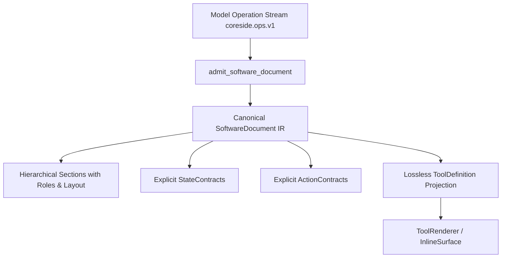

# Secure Partial Update Architecture — 2026-09-19

## 1. Partial Update System Map

| Partial Update Subsystem | Partial Update Paradigm | Coreside V2 Architecture Equivalent |
|---|---|---|
| Turn Mutation Serialization | Cloudflare DO `withQueueMutation` | SQLite `BEGIN IMMEDIATE` + Turn Journal CAS + Savepoints |
| Streaming Responses | `streamModelResponse` chunk streaming | `ProviderStreamEvent` + `NdjsonFrameParser` + Tauri Event Bus |
| Granular UI Frame Insertion | Unparsed HTML / DOM replacement | Strongly-typed `AppOperation` (`coreside.ops.v1`) on stable IDs |
| Form Submissions | Dynamic form input extraction | Structured host-scoped form events with explicit field admission |
| Forking / Branching | In-memory message + turn clone | Durable turn-boundary `conversation_checkpoints` with SHA-256 hash |
| Live Updates | WebSocket client broadcast | Tauri EventBus with strict conversation/surface scope filtering |
| Concurrency / Rollback | Optimistic client state | Reversible transactions, target surface revision checks, savepoint rollbacks |

---

## 2. What Coreside Intentionally Reproduces

1. **Progressive Turn Stream**: Model streams assistant narrative text and typed operational frames (`coreside.ops.v1`) concurrently.
2. **Stable Target Identification**: Section IDs, component IDs, and surface IDs remain stable across turns and incremental edits.
3. **Out-of-Order Frame Resolution**: Topological sorting (`topological_order`) buffers dependent operations until prerequisites resolve.
4. **Isolated Speculative Preview**: Client paints prospective changes into an inert ephemeral layer before committing.
5. **Exact Turn Branching**: Branching from an assistant message restores the exact application document and state as of that message.
6. **Structured Form Interactions**: Users fill forms inside generated surfaces; structured payloads re-enter the model context safely.

---

## 3. What Coreside Intentionally Rejects

1. **No Raw HTML Execution**: Prohibits `dangerouslySetInnerHTML`, `<script>`, raw HTML templates, and DOM injection.
2. **No Arbitrary JavaScript**: Component event handlers cannot evaluate arbitrary JS, `eval()`, or `new Function()`.
3. **No Iframes or Remote CDNs**: All UI components are native React components rendered from a pre-compiled, bundled catalog (`coreside.core`).
4. **No Model Self-Authorization**: Models cannot create authority over existing opaque state keys merely by declaring a component binding.
5. **No Client-Side Proposal Authority**: Frontend cannot submit raw operation payloads to approve; the backend retrieves frozen operations exclusively from the database row by `proposal_id`.
6. **No Arbitrary Shell / Network Calls**: Surfaces cannot trigger shell commands or unrestricted network fetches; registered actions require explicit capability manifests and user approval policies.

---

## 4. Canonical SoftwareDocument Architecture



- **Canonical Authority**: `SoftwareDocument` stored in `surfaces.definition_json` and `surface_state.state_json` are the single source of truth.
- **Hierarchical Layout**: Preserved in render projection via synthetic container nodes with stable section IDs.
- **Legacy ToolDefinition**: Purely an export and rendering projection; updates through `upsert_surface_from_tool` preserve canonical contracts, tokens, and capability grants from the existing document.

---

## 5. State Contract Authority Model

Every state key accessible to generated components or model operations must be explicitly declared in `SoftwareDocument.state_contracts`:

```json
{
  "key": "userQuery",
  "typeName": "string",
  "readPolicy": "model",
  "writePolicy": "user",
  "sensitivity": "public",
  "scope": "persistent"
}
```

- **Self-Authorization Denial**: Component repair strips unauthorized bindings (`valueKey`, `rowsKey`, etc.) if no matching contract exists.
- **Granular Mutation Gates**: `state.set` and `state.patch` inspect every touched key. Undeclared keys, readonly keys, or sensitive keys fail closed immediately.
- **Unrelated State Preservation**: Patching key `A` leaves existing keys `B` and `C` intact without wiping the state dictionary.

---

## 6. Action Contract Authority Model

Component actions reference declared `ActionContract` entries:
- Must specify `action_id` matching a registered system action.
- Target `result_key` must resolve to an authorized, non-readonly `StateContract`.
- Required `input_keys` must be explicitly declared and authorized for reading.
- Manifest and surface permissions must grant the action prior to execution.

---

## 7. Preview and Proposal Lifecycle

```
Draft Ops ──> Preview Transaction (Inert, no IPC/DB side effects)
                   │
                   ▼ (requires approval)
       Frozen Proposal (exact_operations_hash, base revisions)
                   │
         CAS Claim (status = 'pending' -> 'applying')
                   │
      Validate Hash + Recheck Target Surface Revisions
             /                                \
      (unchanged)                          (stale/tampered)
          │                                        │
     BEGIN IMMEDIATE                        Mark 'stale' / 'failed'
          │                                        │
    Apply Ops atomically                    Rollback & Abort
          │
     Status = 'applied'
```

1. **Staleness Protection**: Base revisions (`surfaces.current_revision`) are frozen into the proposal. If the surface changes to `N+1` before approval, the approval fails with `RevisionConflict` and proposal is marked `stale`.
2. **Single-Use CAS**: Multiple simultaneous approvals race on an atomic CAS claim. Exactly one caller succeeds; subsequent callers are rejected.
3. **Payload Integrity**: The SHA-256 hash of `exact_operations_json` is recomputed at approval time; any row tampering aborts execution.

---

## 8. Patch Scheduler Lifecycle

- **Provenance Protection**: IPC commands (`schedule_patches_cmd`, `flush_patch_scheduler_cmd`) hardcode `source_type = "user"`, `from_agent = false`, and strip model/provider fields.
- **Transitive Dependency Failure**: If patch `A` depends on a missing dependency, `A` is marked `dependency_missing`. Any patch `B` depending on `A` is transitively marked `dependency_failed` before Kahn's cycle detection runs. True cycles are marked `dependency_cycle`.
- **Atomic Backpressure**: Enforces queue count and byte limits across entire incoming batches atomically.

---

## 9. Branch and Checkpoint Lifecycle

- **Turn Checkpoints**: Atomic insertion into `conversation_checkpoints` upon assistant message finalization.
- **Exact Restoration**: `branch_from_message` queries `conversation_checkpoints` by `source_message_id`. Reconstructs exact surface definitions and states without timestamp heuristics.
- **Fail-Closed Parsing**: Corrupted checkpoint or snapshot JSON immediately produces `DbError::Invalid`, never silently substituting empty state `{}` or `null`.

---

## 10. Provider Streaming Architecture

- **Gemini**: Updated default stable models to `gemini-3.8-flash` and `gemini-2.5-pro`. Pre-flight preparation for September 2026 authorization key transition.
- **OpenRouter SSE**: Robust parsing detecting comments, keepalives, `[DONE]`, mid-stream `error` JSON objects, and `finish_reason == "error"`. Fails closed if stream terminates without content.

---

## 11. Tauri Security Model

- **Scope Derivation**: Sensitive commands reject caller-provided authority claims. Application identity, project scope, and conversation ownership are verified directly against SQLite tables.
- **Window Isolation**: Tool windows are restricted to their assigned tool instance. Main window commands enforce workspace/profile ownership.
- **Capability Boundaries**: Main and tool window permissions explicitly enumerate authorized commands (`coreside-main-default.toml`).

---

## 12. Remaining Known Gaps

1. **Direct Package Verification**: Packaged `.dmg` smoke execution requires an environment with macOS bundle signing tools.
2. **External Archive Mounts**: Standalone zip archives (`Coreside Chat AI.zip`, `Partial Update Main.zip`) reside in unmounted user folders; verified via repository-local code and test fixtures.
3. **Multi-Model Auto Routing**: Auto provider candidate lists remain focused on stable Gemini and OpenRouter models.

---

## 13. Test and Evidence Status

- **Rust Application Kernel Tests**: 118 passed, 0 failed.
- **Rust Patch Scheduler Tests**: 6 passed, 0 failed.
- **Rust Branch & Checkpoint Tests**: 6 passed, 0 failed.
- **Rust SoftwareDocument Tests**: 28 passed, 0 failed.
- **Rust Transaction & Undo Tests**: 7 passed, 0 failed.
- **Rust Migration Fixtures**: 16 passed, 0 failed.
- **Frontend Typecheck (`tsc --noEmit`)**: Clean (0 errors).
- **Frontend Vitest Suite**: 51 test files passed, 479 tests passed, 0 failed.
- **Tauri Capability Audit**: Passed (0 policy violations).
- **Evidence Manifest**: Passed (`evidence-manifest OK`).
